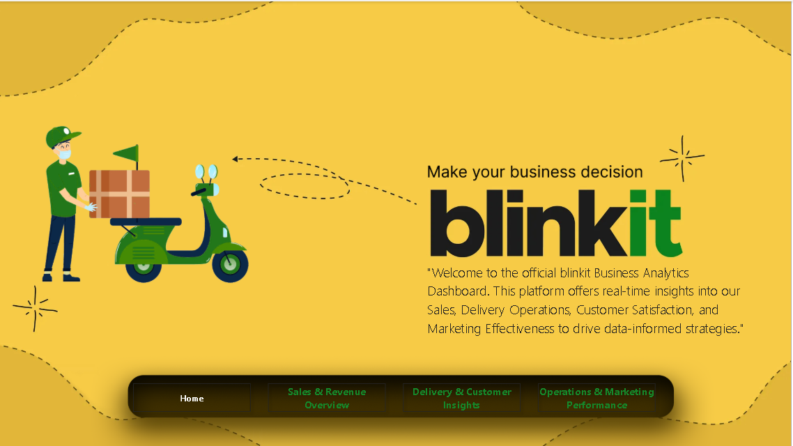

# 🟡 Blinkit Business Analytics Dashboard

> Power BI dashboard for Blinkit's Sales, Delivery, Customer & Marketing analysis.

---

## 📊 Project Overview

360-degree view of Blinkit's business performance covering:
- Sales & Revenue trends
- Delivery efficiency & logistics
- Customer sentiment & segmentation
- Marketing ROI & campaign performance
- Inventory management

---

## 📁 Dashboard Pages

### 🏠 1. Home

---

### 💰 2. Sales & Revenue Overview

| Metric | Value |
|--------|-------|
| Revenue | ₹23M |
| Count Orders | 9,893 |
| Count Customers | 8,224 |
| Count Products | 19 |
| Total Quantity | 36K |
| Total Price | ₹19.79M |

---

### 🚚 3. Delivery & Customer Insights

| Metric | Value |
|--------|-------|
| Total Orders | 66K |
| Count Delivery | 2,526 |
| Avg Delivery Time | 10 min |
| Avg Distance | 3 km |
| Positive Reviews | 35K (70.23%) |
| Neutral | 9,893 (19.79%) |
| Negative | 4,991 (9.98%) |

---

### 📣 4. Operations & Marketing Performance

| Metric | Value |
|--------|-------|
| Total Revenue | ₹3M |
| Total Spend | ₹741K |
| Avg ROAS | 3x |
| Delayed Orders | 15K |
| Delivery Rate | 70% |
| Total Stock | 6M |
| Damaged Stock | 3M |

---

## 🛠️ Tools Used

| Tool | Purpose |
|------|---------|
| Power BI Desktop | Dashboard development |
| MySQL | Data source |
| DAX | Measures & KPIs |
| Power Query | Data transformation |

---

---

## 📌 Key Insights

- 🟢 70%+ customer sentiment Positive
- 📦 Average delivery time 10 minutes
- 💳 Payment methods ~25% each (Card/UPI/Wallet/Cash)
- 📣 App Push campaigns highest revenue
- ⚠️ 50% inventory damages
